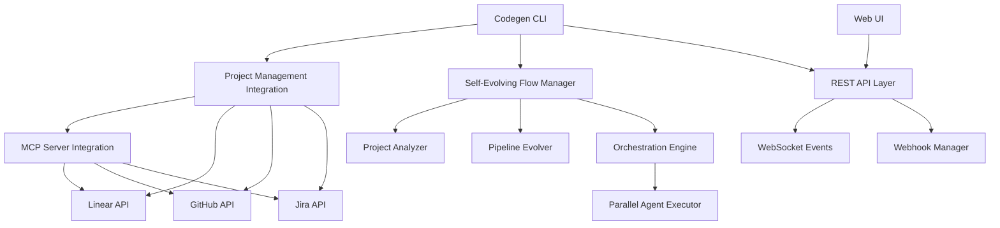

# Codegen Visual Orchestration System - Complete Integration Guide

## 🚀 Self-Evolving CI/CD Flow with Project Management

This document describes the complete integration of Codegen's Visual Orchestration System with project management platforms, MCP servers, and CLI commands for intelligent, self-evolving CI/CD workflows.

## 📋 Table of Contents

- [Overview](#overview)
- [Architecture](#architecture)
- [CLI Commands](#cli-commands)
- [Project Management Integration](#project-management-integration)
- [MCP Server Integration](#mcp-server-integration)
- [Self-Evolution System](#self-evolution-system)
- [Configuration](#configuration)
- [Usage Examples](#usage-examples)
- [API Integration](#api-integration)
- [Deployment](#deployment)
- [Troubleshooting](#troubleshooting)

## 🎯 Overview

The Codegen Visual Orchestration System is a comprehensive CI/CD platform that:

- **Analyzes Projects Intelligently**: Automatically detects project type, languages, frameworks, and complexity
- **Creates Adaptive Pipelines**: Generates optimized CI/CD pipelines based on project characteristics
- **Integrates with Project Management**: Seamlessly works with Linear, GitHub, Jira, and ClickUp
- **Self-Evolves**: Learns from execution patterns and automatically optimizes performance
- **Provides Multiple Interfaces**: CLI commands, REST API, WebSocket real-time updates, and web UI
- **Supports MCP Servers**: Integrates with Model Context Protocol servers for enhanced capabilities

## 🏗️ Architecture



## 💻 CLI Commands

### Main Orchestration Commands

```bash
# Create intelligent pipeline from project analysis
codegen orchestrate create /path/to/project \
  --name "my-pipeline" \
  --output "pipeline.yaml" \
  --requirements '{"security_level": "high"}'

# Analyze project structure and characteristics
codegen orchestrate analyze /path/to/project --format table

# Monitor pipeline execution in real-time
codegen orchestrate monitor pipeline-id --follow

# Evolve pipeline based on performance data
codegen orchestrate evolve pipeline-id --auto-apply

# List all configured pipelines
codegen orchestrate list --status running

# Start web-based visual designer
codegen orchestrate serve --port 8000
```

### Project Management Commands

```bash
# Setup integrations with project management platforms
codegen orchestrate project setup linear project-id \
  --token "$LINEAR_TOKEN" \
  --config "config.yaml"

codegen orchestrate project setup github owner/repo \
  --token "$GITHUB_TOKEN" \
  --webhook "https://webhooks.example.com/github"

# List configured integrations
codegen orchestrate project list --format table

# Sync tasks with external platforms
codegen orchestrate project sync linear-main

# Get analytics from project management platform
codegen orchestrate project analytics linear-main --range 30d

# Test integration connectivity
codegen orchestrate project test linear-main --create-task
```

## 🔗 Project Management Integration

### Supported Platforms

| Platform | Features | MCP Support | Direct API |
|----------|----------|-------------|------------|
| **Linear** | Issues, Projects, Teams, Cycles | ✅ | ✅ |
| **GitHub** | Issues, PRs, Projects, Actions | ✅ | ✅ |
| **Jira** | Issues, Projects, Workflows | ✅ | ✅ |
| **ClickUp** | Tasks, Spaces, Teams | 🔄 Planned | ✅ |

### Integration Features

- **Automatic Task Creation**: Creates project management tasks for pipeline stages
- **Status Synchronization**: Updates task status based on pipeline execution
- **Failure Issue Creation**: Automatically creates high-priority issues for failures
- **Analytics Integration**: Pulls metrics from project management platforms
- **Webhook Support**: Real-time notifications and updates

### Example Integration Setup

```yaml
# orchestration-config.yaml
integrations:
  main_project:
    platform: "linear"
    project_id: "team-id"
    auth_token: "${LINEAR_API_TOKEN}"
    auto_create_tasks: true
    auto_update_status: true
    task_prefix: "[CI/CD]"
    assignee_mapping:
      build: "alice@team.com"
      test: "bob@team.com"
      deploy: "charlie@team.com"
```

## 🔌 MCP Server Integration

### MCP Server Configuration

```yaml
mcp_servers:
  linear:
    url: "ws://localhost:8001"
    token: "${LINEAR_API_TOKEN}"
    capabilities:
      - create_issue
      - update_issue
      - search_issues
  
  github:
    url: "ws://localhost:8002"
    token: "${GITHUB_TOKEN}"
    capabilities:
      - create_issue
      - create_pr
      - search_code
```

### Available MCP Tools

- **Linear**: `create_issue`, `update_issue`, `list_issues`, `search_issues`
- **GitHub**: `create_issue`, `create_pr`, `update_pr`, `search_code`
- **Jira**: `create_issue`, `update_issue`, `search_issues`, `add_comment`

## 🧠 Self-Evolution System

### Intelligence Features

- **Project Analysis**: Detects languages, frameworks, complexity, and patterns
- **Performance Learning**: Analyzes execution history to identify optimization opportunities
- **Automatic Optimization**: Applies improvements based on success metrics
- **Template Evolution**: Updates pipeline templates based on learnings across projects

### Evolution Triggers

- Success rate drops below threshold (default: 90%)
- Average execution time exceeds limit (default: 30 minutes)
- Resource usage patterns indicate inefficiency
- User feedback indicates issues

### Example Evolution Output

```json
{
  "evolution_suggestions": [
    {
      "type": "parallel_optimization",
      "description": "Tests can run in parallel with build stage",
      "impact": "30% faster execution",
      "confidence": 0.89
    },
    {
      "type": "resource_optimization", 
      "description": "Reduce memory allocation for code analysis",
      "impact": "20% resource savings",
      "confidence": 0.76
    }
  ]
}
```

## ⚙️ Configuration

### Complete Configuration Example

```yaml
# orchestration-config.yaml
mcp_servers:
  linear:
    url: "ws://localhost:8001"
    token: "${LINEAR_API_TOKEN}"

integrations:
  main_project:
    platform: "linear"
    project_id: "team-id"
    auth_token: "${LINEAR_API_TOKEN}"
    auto_create_tasks: true
    auto_update_status: true

evolution:
  enabled: true
  analysis_window: "7d"
  auto_apply_threshold: 0.8
  optimization_triggers:
    - "failure_rate > 10%"
    - "avg_duration > 30min"

webhooks:
  endpoints:
    - name: "slack_notifications"
      url: "${SLACK_WEBHOOK_URL}"
      events: ["pipeline.failed", "evolution.applied"]

monitoring:
  metrics:
    enabled: true
    retention: "30d"
  alerts:
    - name: "High Failure Rate"
      condition: "pipeline_failure_rate > 15%"
      channels: ["slack"]
```

## 📚 Usage Examples

### Complete Workflow Example

```bash
# 1. Set up project management integration
codegen orchestrate project setup linear my-team \
  --token "$LINEAR_TOKEN" \
  --config "config.yaml"

# 2. Analyze and create pipeline for a web application
codegen orchestrate create ./my-web-app \
  --name "webapp-cicd" \
  --requirements '{"security_level": "high", "deployment_targets": ["staging", "prod"]}'

# 3. Execute pipeline with project management tracking
# (Pipeline creates Linear tasks automatically)

# 4. Monitor execution in real-time
codegen orchestrate monitor webapp-cicd --follow

# 5. Analyze performance and evolve
codegen orchestrate evolve webapp-cicd --auto-apply

# 6. View analytics from Linear
codegen orchestrate project analytics linear --range 30d
```

### Python API Integration

```python
import asyncio
from pathlib import Path
from codegen.orchestration.self_evolving import SelfEvolvingFlowManager
from codegen.orchestration.project_management import (
    ProjectManagementIntegration, 
    ProjectManagementFactory
)

async def main():
    # Initialize managers
    flow_manager = SelfEvolvingFlowManager()
    pm_integration = ProjectManagementIntegration()
    
    # Set up Linear integration
    linear_config = ProjectManagementFactory.create_linear_integration(
        project_id="team-123",
        api_token="linear_token",
        team_id="team-123"
    )
    pm_integration.add_integration("main", linear_config)
    
    # Create intelligent pipeline
    pipeline = await flow_manager.create_intelligent_pipeline(
        Path("./my-project"),
        "intelligent-pipeline"
    )
    
    # Create project management tasks
    tasks = await pm_integration.create_pipeline_tasks(pipeline, "main")
    print(f"Created {len(tasks)} project management tasks")
    
    # Monitor and evolve
    evolution_result = await flow_manager.monitor_and_evolve(pipeline.name)
    print(f"Evolution suggestions: {len(evolution_result.get('evolution_suggestions', []))}")

asyncio.run(main())
```

## 🌐 API Integration

### REST API Endpoints

```bash
# Pipeline Management
GET /api/v1/pipelines              # List pipelines
POST /api/v1/pipelines             # Create pipeline
GET /api/v1/pipelines/{id}         # Get pipeline details
POST /api/v1/pipelines/{id}/execute # Execute pipeline

# Project Management
GET /api/v1/integrations           # List integrations
POST /api/v1/integrations          # Add integration
POST /api/v1/integrations/{id}/sync # Sync with platform

# Real-time Updates
WebSocket /ws                      # Pipeline execution events
```

### Webhook Events

- `pipeline.started` - Pipeline execution begins
- `pipeline.completed` - Pipeline execution completes
- `pipeline.failed` - Pipeline execution fails
- `task.completed` - Individual task completes
- `evolution.applied` - Pipeline optimization applied

## 🚀 Deployment

### Development Setup

```bash
# Install dependencies
pip install -e .

# Run development server
codegen orchestrate serve --reload

# Run demo workflow
python examples/workflow-demo.py ./my-project
```

### Production Deployment

```bash
# Use the deployment script
python deploy-orchestration.py --production

# Or manually with Docker
docker build -t codegen-orchestration .
docker run -p 8000:8000 codegen-orchestration

# With environment variables
export LINEAR_API_TOKEN="your-token"
export GITHUB_TOKEN="your-token"
docker run --env-file .env -p 8000:8000 codegen-orchestration
```

### Environment Variables

| Variable | Description | Required |
|----------|-------------|----------|
| `LINEAR_API_TOKEN` | Linear API token | Optional |
| `GITHUB_TOKEN` | GitHub personal access token | Optional |
| `JIRA_API_TOKEN` | Jira API token | Optional |
| `SLACK_WEBHOOK_URL` | Slack webhook for notifications | Optional |
| `DATABASE_URL` | PostgreSQL connection string | No (uses SQLite) |
| `REDIS_URL` | Redis connection for caching | No |

## 🔧 Troubleshooting

### Common Issues

**CLI Commands Not Found**
```bash
# Ensure orchestration module is installed
pip install -e . 

# Check if commands are available
codegen orchestrate --help
```

**MCP Server Connection Failures**
```bash
# Test MCP server connectivity
codegen orchestrate project test linear-main

# Check server logs and network connectivity
```

**Project Management Integration Issues**
```bash
# Verify API tokens
export LINEAR_API_TOKEN="your-token"

# Test integration
codegen orchestrate project test linear-main --create-task
```

**Pipeline Evolution Not Working**
```bash
# Ensure sufficient execution history
codegen orchestrate monitor pipeline-id

# Check evolution configuration
codegen orchestrate evolve pipeline-id --dry-run
```

### Debug Mode

```bash
# Enable debug logging
export LOG_LEVEL=DEBUG
codegen orchestrate create ./project --debug

# View detailed logs
tail -f ~/.codegen/logs/orchestration.log
```

## 🤝 Contributing

### Development Workflow

1. Fork the repository
2. Create a feature branch: `git checkout -b feature/new-integration`
3. Make your changes and add tests
4. Run tests: `pytest tests/orchestration/`
5. Submit a pull request

### Adding New Integrations

1. Create integration class in `project_management.py`
2. Add MCP server support in `MCPServerIntegration`
3. Update CLI commands in `project_mgmt.py`
4. Add configuration examples
5. Update documentation

## 📄 License

This project is licensed under the MIT License. See [LICENSE](../LICENSE) for details.

## 🔗 Related Documentation

- [Main README](../README.md) - General Codegen information
- [Visual Orchestration README](./README-ORCHESTRATION.md) - Core orchestration system
- [API Documentation](./docs/api.md) - REST API reference
- [MCP Server Guide](./docs/mcp-integration.md) - MCP server setup
- [Deployment Guide](./docs/deployment.md) - Production deployment

---

**Built with ❤️ by the Codegen Team**

For support, please visit our [GitHub Issues](https://github.com/codegen-sh/codegen/issues) or join our community Discord.