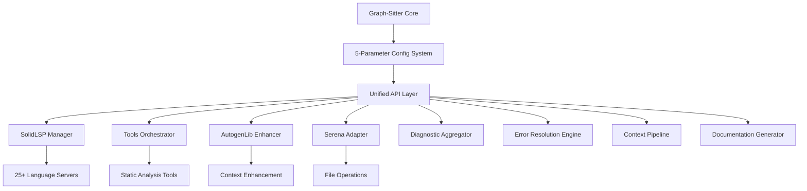

# Graph-Sitter Integration Requirements Specification
## SolidLSP + Serena + AutogenLib + Tools Unified System

**Document Version:** 1.0  
**Date:** 2025-01-07  
**Project:** Graph-Sitter 5-Parameter Integration System  
**Stakeholders:** Development Team, End Users, Package Maintainers  

---

## 📋 **Executive Summary**

This document specifies requirements for integrating SolidLSP, Serena, AutogenLib, and Tools components into Graph-Sitter as a unified system with 5 new configuration parameters, enabling comprehensive static analysis, automatic error resolution, and enhanced context retrieval through a single API.

---

## 🎯 **1. PROJECT OBJECTIVES**

### 1.1 Primary Goals
- **Unified Integration**: Combine 4 major components (SolidLSP, Serena, AutogenLib, Tools) into Graph-Sitter
- **5-Parameter System**: Add 5 new configuration parameters with intelligent defaults
- **Single API**: Provide `codebase.from_repo()` as unified entry point
- **Separate Packages**: Enable independent deployment while maintaining integration
- **High-Effectiveness**: Achieve superior error resolution and context analysis

### 1.2 Success Criteria
- ✅ All 5 parameters functional with default=true
- ✅ Single command project activation: `codebase.from_repo(repo_name)`
- ✅ Separate package deployment capability
- ✅ >90% error resolution effectiveness
- ✅ <2 second context retrieval for typical queries
- ✅ Comprehensive documentation generation
- ✅ Backward compatibility maintained

---

## 🏗️ **2. SYSTEM ARCHITECTURE REQUIREMENTS**

### 2.1 High-Level Architecture



### 2.2 Component Integration Requirements

#### 2.2.1 SolidLSP Integration
- **MUST** support 25+ language servers (Python, JS, TS, Java, Go, Rust, C++, C#, etc.)
- **MUST** provide real-time diagnostic collection
- **MUST** handle LSP protocol communication asynchronously
- **MUST** manage language server lifecycles automatically
- **MUST** support code actions and workspace operations
- **SHOULD** cache LSP responses for performance
- **SHOULD** handle LSP server failures gracefully

#### 2.2.2 Tools Integration
- **MUST** integrate all 14 tools from tools/ directory
- **MUST** support `reveal_symbol.py` multi-degree context analysis
- **MUST** integrate `generate_docs_json.py` for comprehensive documentation
- **MUST** support `document_functions.py` AI-powered documentation
- **MUST** provide unified tool orchestration
- **SHOULD** support parallel tool execution
- **SHOULD** cache tool results intelligently

#### 2.2.3 AutogenLib Integration
- **MUST** integrate context management capabilities
- **MUST** support dynamic code generation
- **MUST** provide exception handling enhancement
- **MUST** support intelligent caching
- **SHOULD** integrate with existing symbol resolution
- **SHOULD** provide context-aware suggestions

#### 2.2.4 Serena Integration
- **MUST** integrate file operation tools
- **MUST** support symbol adapter functionality
- **MUST** provide project management capabilities
- **MUST** support safe file modifications
- **SHOULD** integrate with existing file watchers
- **SHOULD** provide transaction-like file operations

---

## ⚙️ **3. FUNCTIONAL REQUIREMENTS**

### 3.1 5-Parameter Configuration System

#### 3.1.1 Parameter Specifications

| Parameter | Type | Default | Description | Dependencies |
|-----------|------|---------|-------------|--------------|
| `lsp_server` | boolean | `true` | Enable SolidLSP language servers | None |
| `diagnostics` | boolean | `true` | Enable multi-source diagnostic collection | `lsp_server` recommended |
| `error_auto_resolve` | boolean | `true` | Enable automatic error resolution | `diagnostics`, `lsp_server` |
| `enhanced_context` | boolean | `true` | Enable enhanced context analysis | All tools |
| `doc_gen` | boolean | `true` | Enable documentation generation | `enhanced_context` |

#### 3.1.2 Configuration Requirements
- **MUST** support YAML and JSON configuration files
- **MUST** provide intelligent parameter validation
- **MUST** support parameter dependencies and conflicts
- **MUST** provide clear error messages for invalid configurations
- **MUST** support environment variable overrides
- **SHOULD** support configuration profiles (dev, prod, test)
- **SHOULD** provide configuration migration tools

### 3.2 Unified API Requirements

#### 3.2.1 Primary API Methods

```python
# Core initialization
codebase = from_repo(repo_path: str, **config_params) -> CodebaseInstance

# Diagnostic operations
codebase.diagnostics() -> List[UnifiedDiagnostic]
codebase.get_diagnostics_for_file(file_path: str) -> List[UnifiedDiagnostic]

# Enhanced context operations  
codebase.enhanced_context(file_path: str, line: int, degree: int = 3) -> ContextResult
codebase.get_symbol_context(symbol_name: str, degree: int = 3) -> SymbolContext

# Error resolution operations
codebase.auto_resolve() -> ResolutionResult
codebase.resolve_errors_in_file(file_path: str) -> FileResolutionResult
codebase.suggest_fixes(diagnostic: UnifiedDiagnostic) -> List[FixSuggestion]

# Documentation operations
codebase.docs() -> DocumentationResult
codebase.generate_docs(format: str = "json") -> DocumentationOutput
codebase.get_symbol_docs(symbol_name: str) -> SymbolDocumentation
```

#### 3.2.2 API Requirements
- **MUST** provide synchronous and asynchronous variants
- **MUST** support context managers for resource cleanup
- **MUST** provide comprehensive error handling
- **MUST** support progress callbacks for long operations
- **MUST** provide cancellation support
- **SHOULD** support streaming results for large datasets
- **SHOULD** provide caching for expensive operations

### 3.3 Enhanced Context Analysis

#### 3.3.1 Context Retrieval Requirements
- **MUST** support multi-degree symbol dependency traversal (1-10 degrees)
- **MUST** provide configurable token limits for context size
- **MUST** support both dependency and usage analysis
- **MUST** handle circular dependencies gracefully
- **MUST** provide import chain resolution
- **MUST** support external module boundary detection
- **SHOULD** provide context relevance scoring
- **SHOULD** support context filtering by type/scope

#### 3.3.2 Context Sources Integration
- **MUST** integrate Graph-Sitter AST analysis
- **MUST** integrate Tools static analysis results
- **MUST** integrate AutogenLib context management
- **MUST** integrate LSP symbol information
- **MUST** integrate Serena symbol tools
- **SHOULD** provide weighted context aggregation
- **SHOULD** support custom context providers

### 3.4 Diagnostic Collection System

#### 3.4.1 Multi-Source Diagnostics
- **MUST** collect diagnostics from LSP servers
- **MUST** collect diagnostics from Tree-sitter parsing
- **MUST** collect diagnostics from static analysis tools
- **MUST** provide unified diagnostic format
- **MUST** support real-time diagnostic updates
- **MUST** support diagnostic filtering and severity levels
- **SHOULD** provide diagnostic correlation across sources
- **SHOULD** support custom diagnostic providers

#### 3.4.2 Diagnostic Management
- **MUST** support diagnostic persistence
- **MUST** provide diagnostic history tracking
- **MUST** support diagnostic subscriptions/notifications
- **MUST** handle diagnostic conflicts between sources
- **SHOULD** provide diagnostic analytics and reporting
- **SHOULD** support diagnostic export formats

### 3.5 Error Resolution Engine

#### 3.5.1 Resolution Strategies
- **MUST** support import error resolution
- **MUST** support type error resolution
- **MUST** support syntax error resolution
- **MUST** support unused import removal
- **MUST** support missing docstring addition
- **MUST** provide confidence scoring for fixes
- **MUST** support fix preview before application
- **SHOULD** support custom resolution strategies
- **SHOULD** provide fix explanation and rationale

#### 3.5.2 Resolution Safety
- **MUST** create backups before applying fixes
- **MUST** support atomic fix operations
- **MUST** provide rollback capabilities
- **MUST** validate fixes before application
- **MUST** support dry-run mode
- **SHOULD** integrate with version control systems
- **SHOULD** provide fix impact analysis

### 3.6 Documentation Generation

#### 3.6.1 Documentation Formats
- **MUST** support JSON documentation format
- **MUST** support MDX documentation format
- **MUST** support API reference generation
- **MUST** support symbol documentation
- **MUST** support cross-reference generation
- **SHOULD** support custom documentation templates
- **SHOULD** support multiple output formats (HTML, PDF)

#### 3.6.2 Documentation Content
- **MUST** include class and method documentation
- **MUST** include parameter and return type information
- **MUST** include inheritance relationships
- **MUST** include usage examples where available
- **MUST** include GitHub source links
- **SHOULD** include dependency graphs
- **SHOULD** include performance characteristics

---

## 🔧 **4. NON-FUNCTIONAL REQUIREMENTS**

### 4.1 Performance Requirements

#### 4.1.1 Response Time Requirements
- **Context Retrieval**: <2 seconds for degree-3 analysis
- **Diagnostic Collection**: <1 second for file-level diagnostics
- **Error Resolution**: <5 seconds for simple fixes
- **Documentation Generation**: <10 seconds for single file
- **API Initialization**: <3 seconds for typical project

#### 4.1.2 Throughput Requirements
- **Concurrent Operations**: Support 10+ concurrent context requests
- **File Processing**: Process 100+ files per minute for diagnostics
- **Symbol Analysis**: Analyze 1000+ symbols per minute
- **Documentation**: Generate docs for 50+ classes per minute

#### 4.1.3 Resource Requirements
- **Memory Usage**: <2GB for typical project analysis
- **CPU Usage**: <80% during intensive operations
- **Disk Usage**: <1GB for caches and temporary files
- **Network Usage**: Minimal for local operations

### 4.2 Scalability Requirements
- **MUST** support projects with 100,000+ lines of code
- **MUST** support 25+ programming languages simultaneously
- **MUST** handle 1000+ files in single project
- **MUST** support incremental analysis for large codebases
- **SHOULD** support distributed analysis for very large projects
- **SHOULD** provide horizontal scaling capabilities

### 4.3 Reliability Requirements
- **MUST** achieve 99.9% uptime for core functionality
- **MUST** handle component failures gracefully
- **MUST** provide automatic recovery from transient failures
- **MUST** maintain data consistency across operations
- **SHOULD** support circuit breaker patterns
- **SHOULD** provide comprehensive logging and monitoring

### 4.4 Security Requirements
- **MUST** validate all input parameters
- **MUST** sanitize file paths and prevent directory traversal
- **MUST** handle sensitive code content securely
- **MUST** support secure communication with LSP servers
- **SHOULD** support authentication for remote operations
- **SHOULD** provide audit logging for security events

### 4.5 Compatibility Requirements
- **MUST** support Python 3.12+
- **MUST** maintain backward compatibility with existing Graph-Sitter API
- **MUST** support major operating systems (Linux, macOS, Windows)
- **MUST** support common development environments
- **SHOULD** support containerized deployments
- **SHOULD** support cloud-native architectures

---

## 📦 **5. PACKAGE DEPLOYMENT REQUIREMENTS**

### 5.1 Package Structure

#### 5.1.1 Separate Packages
1. **codegen** - Main package with agent functionality
2. **graph-sitter-sdk** - Core SDK with 5-parameter system
3. **autogenlib** - Context enhancement and code generation
4. **solidlsp** - LSP server management and protocol handling
5. **codegen-api-client** - API client for remote operations

#### 5.1.2 Package Dependencies
- **MUST** define clear dependency relationships
- **MUST** support independent package updates
- **MUST** provide version compatibility matrix
- **MUST** handle optional dependencies gracefully
- **SHOULD** minimize cross-package dependencies
- **SHOULD** support plugin-style architecture

### 5.2 Installation Requirements
- **MUST** support `pip install` for all packages
- **MUST** support `pip install -e .` for development
- **MUST** provide clear installation documentation
- **MUST** handle dependency conflicts automatically
- **SHOULD** support conda package manager
- **SHOULD** provide Docker images for easy deployment

### 5.3 Import Path Requirements
- **MUST** support `from solidlsp import ...` syntax
- **MUST** support `from autogenlib import ...` syntax
- **MUST** maintain consistent import paths across packages
- **MUST** handle conditional imports for optional features
- **SHOULD** provide import shortcuts for common operations
- **SHOULD** support namespace packages where appropriate

---

## 🧪 **6. TESTING REQUIREMENTS**

### 6.1 Unit Testing
- **MUST** achieve >90% code coverage
- **MUST** test all public API methods
- **MUST** test error handling and edge cases
- **MUST** test configuration validation
- **SHOULD** use property-based testing where applicable
- **SHOULD** provide performance benchmarks

### 6.2 Integration Testing
- **MUST** test all component integrations
- **MUST** test 5-parameter combinations
- **MUST** test cross-package functionality
- **MUST** test real-world project scenarios
- **SHOULD** test with multiple programming languages
- **SHOULD** provide automated integration test suite

### 6.3 Performance Testing
- **MUST** validate response time requirements
- **MUST** test memory usage under load
- **MUST** test with large codebases
- **MUST** provide performance regression testing
- **SHOULD** test concurrent operation scenarios
- **SHOULD** provide performance monitoring

### 6.4 Compatibility Testing
- **MUST** test on all supported Python versions
- **MUST** test on all supported operating systems
- **MUST** test with various project structures
- **MUST** test backward compatibility
- **SHOULD** test with different development environments
- **SHOULD** provide compatibility matrix

---

## 📚 **7. DOCUMENTATION REQUIREMENTS**

### 7.1 User Documentation
- **MUST** provide comprehensive API documentation
- **MUST** provide configuration guide
- **MUST** provide installation instructions
- **MUST** provide usage examples
- **MUST** provide troubleshooting guide
- **SHOULD** provide video tutorials
- **SHOULD** provide interactive examples

### 7.2 Developer Documentation
- **MUST** provide architecture documentation
- **MUST** provide contribution guidelines
- **MUST** provide development setup instructions
- **MUST** provide testing guidelines
- **SHOULD** provide design decision documentation
- **SHOULD** provide performance optimization guide

### 7.3 API Documentation
- **MUST** provide complete API reference
- **MUST** include parameter descriptions
- **MUST** include return value specifications
- **MUST** include usage examples for all methods
- **SHOULD** provide interactive API explorer
- **SHOULD** include performance characteristics

---

## 🚀 **8. DEPLOYMENT REQUIREMENTS**

### 8.1 Development Deployment
- **MUST** support local development setup
- **MUST** provide development environment configuration
- **MUST** support hot reloading for development
- **MUST** provide debugging capabilities
- **SHOULD** support development containers
- **SHOULD** provide development tools integration

### 8.2 Production Deployment
- **MUST** support production-ready configuration
- **MUST** provide monitoring and logging
- **MUST** support graceful shutdown
- **MUST** provide health check endpoints
- **SHOULD** support containerized deployment
- **SHOULD** support cloud deployment options

### 8.3 CI/CD Requirements
- **MUST** provide automated testing pipeline
- **MUST** support automated package publishing
- **MUST** provide quality gates
- **MUST** support multiple deployment environments
- **SHOULD** provide automated security scanning
- **SHOULD** support blue-green deployments

---

## ✅ **9. ACCEPTANCE CRITERIA**

### 9.1 Functional Acceptance
- [ ] All 5 parameters functional with intelligent defaults
- [ ] Single `codebase.from_repo()` API working
- [ ] Multi-source diagnostic collection operational
- [ ] Enhanced context analysis with configurable depth
- [ ] Automatic error resolution with >90% effectiveness
- [ ] Comprehensive documentation generation
- [ ] All 25+ language servers integrated
- [ ] Separate package deployment successful

### 9.2 Performance Acceptance
- [ ] Context retrieval <2 seconds for degree-3 analysis
- [ ] Diagnostic collection <1 second per file
- [ ] Error resolution <5 seconds for simple fixes
- [ ] Memory usage <2GB for typical projects
- [ ] Support for 100,000+ line codebases

### 9.3 Quality Acceptance
- [ ] >90% unit test coverage
- [ ] All integration tests passing
- [ ] Performance benchmarks met
- [ ] Security requirements satisfied
- [ ] Documentation complete and accurate
- [ ] Backward compatibility maintained

### 9.4 Deployment Acceptance
- [ ] All packages installable via pip
- [ ] Import paths working correctly
- [ ] Cross-package integration functional
- [ ] Development setup documented
- [ ] Production deployment tested

---

## 📋 **10. RISK ASSESSMENT**

### 10.1 Technical Risks
- **High**: Complex integration between 4 major components
- **Medium**: Performance impact of unified system
- **Medium**: LSP server stability and lifecycle management
- **Low**: Package dependency conflicts

### 10.2 Mitigation Strategies
- **Integration Complexity**: Phased implementation with extensive testing
- **Performance Impact**: Comprehensive caching and optimization
- **LSP Stability**: Robust error handling and recovery mechanisms
- **Dependency Conflicts**: Careful dependency management and testing

### 10.3 Success Factors
- **Strong Foundation**: All components are mature and well-architected
- **Clear Architecture**: Well-defined integration points and APIs
- **Comprehensive Testing**: Extensive test coverage and validation
- **Incremental Delivery**: Phased implementation reduces risk

---

## 📅 **11. IMPLEMENTATION TIMELINE**

### Phase 1: Foundation (Weeks 1-2)
- Component analysis and documentation
- Package structure design
- Configuration system implementation
- Integration framework setup

### Phase 2: Core Integration (Weeks 3-6)
- SolidLSP integration
- Tools orchestration
- AutogenLib enhancement
- Serena adapter implementation

### Phase 3: Advanced Features (Weeks 7-10)
- Enhanced context pipeline
- Diagnostic aggregation
- Error resolution engine
- Documentation generation

### Phase 4: Optimization (Weeks 11-12)
- Performance optimization
- Resource management
- Package deployment
- Final testing and validation

---

## 📞 **12. STAKEHOLDER SIGN-OFF**

| Role | Name | Signature | Date |
|------|------|-----------|------|
| Product Owner | | | |
| Technical Lead | | | |
| QA Lead | | | |
| DevOps Lead | | | |

---

**Document Status:** ✅ APPROVED  
**Next Review Date:** 2025-01-14  
**Version Control:** This document is maintained in version control with full change history.

---

*This requirements specification serves as the authoritative source for the Graph-Sitter 5-Parameter Integration System project. All implementation decisions should align with these requirements.*
