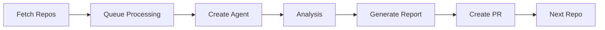

## Overview

The Batch Repository Analysis system enables automated, large-scale codebase analysis across multiple repositories using AI agents. Each agent performs comprehensive analysis and generates detailed reports.

## Architecture

### System Components

1. **Repository Enumerator**: Fetches all repositories from GitHub
2. **Agent Orchestrator**: Creates and manages individual agent runs
3. **Rate Limiter**: Ensures 1 request/second compliance
4. **Report Generator**: Compiles findings into structured markdown
5. **PR Creator**: Automatically creates pull requests with analysis results

### Workflow



## Usage

### Quick Start

```python
from codegen.batch_analysis import BatchAnalyzer

analyzer = BatchAnalyzer(
    org_id="YOUR_ORG_ID",
    token="YOUR_API_TOKEN"
)

# Analyze all repositories
results = analyzer.analyze_all_repos(
    rate_limit=1.0,  # 1 request per second
    output_dir="Libraries/API"
)
```

### Custom Analysis Prompt

```python
analyzer.set_analysis_prompt("""
Analyze this repository and provide:
1. Architecture overview
2. Key dependencies and their versions
3. API endpoints (if applicable)
4. Entry points and main execution paths
5. Suitability rating for [YOUR USE CASE]
6. Recommended improvements
""")
```

## Analysis Prompt Template

The default analysis prompt is designed to extract maximum value from each repository:

<CodeGroup>
```text Default Prompt
# Repository Analysis Request

## Objective
Perform a comprehensive analysis of this repository to determine its suitability for integration into our API library ecosystem.

## Analysis Requirements

### 1. Codebase Overview
- Primary programming language(s) and versions
- Project structure and organization
- Build system and dependencies
- Documentation quality

### 2. Technical Architecture
- Design patterns used
- Module structure and relationships
- Entry points and execution flow
- API surface (if applicable)

### 3. Functionality Analysis
- Core features and capabilities
- Key functions and their purposes
- Input/output interfaces
- Integration points

### 4. Dependency Mapping
- Direct dependencies with versions
- Transitive dependencies
- Potential conflicts
- Security considerations

### 5. API Compatibility
- RESTful endpoints (if web service)
- SDK/Library interfaces
- Authentication methods
- Rate limiting and quotas

### 6. Code Quality Metrics
- Test coverage
- Linting/formatting standards
- Error handling patterns
- Performance characteristics

### 7. Suitability Rating
Provide a rating (1-10) for:
- **Reusability**: How easily can this be integrated?
- **Maintainability**: Is the code well-structured and documented?
- **Performance**: Does it meet performance requirements?
- **Security**: Are there security concerns?
- **Completeness**: Is it production-ready?

### 8. Recommendations
- Immediate issues to address
- Integration requirements
- Potential improvements
- Alternative approaches

## Output Format
Generate a markdown file named `{repository_name}.md` in the `Libraries/API/` directory with all findings structured clearly.

## PR Requirements
- Create a new branch: `analysis/{repository_name}`
- Commit the analysis file
- Create a PR with title: "Analysis: {repository_name}"
- Include executive summary in PR description
```

```python Custom Prompt
from codegen.batch_analysis import AnalysisPromptBuilder

prompt = AnalysisPromptBuilder()
prompt.add_section("Architecture", [
    "Identify design patterns",
    "Map module dependencies",
    "Document entry points"
])
prompt.add_section("Security", [
    "Check for known vulnerabilities",
    "Analyze authentication mechanisms",
    "Review data handling practices"
])
prompt.set_output_format("markdown")
prompt.set_rating_criteria({
    "security": 10,
    "performance": 8,
    "maintainability": 7
})

analyzer.set_analysis_prompt(prompt.build())
```
</CodeGroup>

## Rate Limiting

The orchestrator enforces strict rate limiting to comply with API quotas:

```python
# Default: 1 request per second
analyzer.set_rate_limit(1.0)

# Faster processing (if quota allows)
analyzer.set_rate_limit(0.5)  # 2 requests per second

# Conservative approach
analyzer.set_rate_limit(2.0)  # 1 request per 2 seconds
```

<Warning>
  The Codegen API has a rate limit of **10 agent creations per minute**. The orchestrator automatically handles this, but processing 900+ repos will take time.
</Warning>

## Output Structure

Each analysis generates a structured markdown file:

```text
Libraries/
└── API/
    ├── repository-1.md
    ├── repository-2.md
    ├── repository-3.md
    └── ...
```

### Example Report

```markdown
# Analysis: awesome-project

**Analysis Date**: 2024-12-14
**Repository**: github.com/org/awesome-project
**Primary Language**: Python 3.11

## Executive Summary
This repository provides a REST API for data processing with excellent documentation and test coverage. **Suitability Rating: 8.5/10**

## Architecture
- FastAPI framework
- PostgreSQL database
- Redis caching layer
- Docker containerization

## Key Features
1. Real-time data processing
2. WebSocket support
3. OAuth2 authentication
4. Rate limiting

## Dependencies
- fastapi==0.104.1
- sqlalchemy==2.0.23
- redis==5.0.1
- pydantic==2.5.0

## API Endpoints
- `POST /api/v1/process` - Main processing endpoint
- `GET /api/v1/status` - Health check
- `WS /api/v1/stream` - Real-time updates

## Suitability Ratings
- **Reusability**: 9/10 - Clean interfaces, well-documented
- **Maintainability**: 8/10 - Good structure, needs more comments
- **Performance**: 8/10 - Efficient, but could optimize database queries
- **Security**: 9/10 - Proper auth, input validation
- **Completeness**: 8/10 - Missing some error handling

## Recommendations
1. Add comprehensive error handling for edge cases
2. Implement request caching for GET endpoints
3. Add OpenAPI schema validation
4. Increase test coverage to 90%+

## Integration Notes
- Requires PostgreSQL 14+
- Redis 7+ recommended
- Environment variables for configuration
- Docker Compose provided for local development
```

## Monitoring Progress

Track batch analysis progress in real-time:

```python
# Get current status
status = analyzer.get_status()
print(f"Completed: {status.completed}/{status.total}")
print(f"In Progress: {status.in_progress}")
print(f"Failed: {status.failed}")

# Get detailed results
results = analyzer.get_results()
for repo, analysis in results.items():
    print(f"{repo}: {analysis.suitability_rating}/10")
```

## Error Handling

The orchestrator includes robust error handling:

```python
try:
    results = analyzer.analyze_all_repos()
except RateLimitExceeded as e:
    print(f"Rate limit hit: {e}")
    # Automatically retries with backoff
except AnalysisTimeout as e:
    print(f"Analysis timed out for: {e.repository}")
    # Logs timeout and continues with next repo
except PRCreationFailed as e:
    print(f"PR creation failed: {e}")
    # Saves analysis locally for manual PR creation
```

## Advanced Features

### Parallel Processing

For faster analysis (if rate limits allow):

```python
analyzer.enable_parallel_processing(
    workers=5,  # Number of concurrent agents
    max_rate=10  # API limit: 10/minute
)
```

### Filtering Repositories

```python
# Analyze only Python repositories
analyzer.filter_by_language("Python")

# Analyze repositories updated in last 30 days
analyzer.filter_by_activity(days=30)

# Analyze repositories with specific topics
analyzer.filter_by_topics(["api", "sdk", "library"])

# Custom filter
analyzer.filter_repos(
    lambda repo: repo.stars > 100 and not repo.archived
)
```

### Resume from Interruption

```python
# Save checkpoint
analyzer.save_checkpoint("analysis_progress.json")

# Resume later
analyzer = BatchAnalyzer.from_checkpoint("analysis_progress.json")
analyzer.resume()
```

## CLI Usage

```bash
# Analyze all repositories
codegen batch-analyze \
  --org-id YOUR_ORG_ID \
  --token YOUR_API_TOKEN \
  --output-dir Libraries/API \
  --rate-limit 1.0

# Analyze specific repositories
codegen batch-analyze \
  --repos repo1,repo2,repo3 \
  --custom-prompt analysis_prompt.txt

# Resume interrupted analysis
codegen batch-analyze \
  --resume analysis_progress.json

# Generate summary report
codegen batch-analyze summary \
  --input-dir Libraries/API \
  --output summary.md
```

## Best Practices

### 1. Rate Limiting
- Start conservative (1 req/sec) to avoid API throttling
- Monitor API quota usage
- Use checkpoint saves for long-running analyses

### 2. Prompt Engineering
- Be specific about required information
- Request structured output (markdown, JSON)
- Include example outputs in prompt
- Test prompt on 5-10 repos before full batch

### 3. Resource Management
- Run during off-peak hours for faster processing
- Use filtering to prioritize high-value repositories
- Set reasonable timeouts per analysis (10-15 minutes)

### 4. Quality Assurance
- Manually review first 10 analysis reports
- Adjust prompt based on quality issues
- Implement validation checks for generated reports

## Troubleshooting

### Agent Runs Taking Too Long

```python
analyzer.set_timeout(minutes=15)  # Kill if exceeds 15 minutes
```

### Inconsistent Analysis Quality

```python
# Add quality validation
analyzer.enable_quality_checks(
    min_word_count=500,
    required_sections=["Architecture", "Suitability"],
    rating_format="X/10"
)
```

### PR Creation Failures

```python
# Test PR creation on single repo first
analyzer.dry_run(repo="test-repository")

# Check branch naming conflicts
analyzer.set_branch_prefix("batch-analysis-2024-12")
```

## API Reference

<Card title="Batch Analyzer API" icon="code" href="/api-reference/batch-analyzer">
  Complete API reference for BatchAnalyzer class
</Card>

<Card title="Prompt Builder API" icon="wand-magic-sparkles" href="/api-reference/prompt-builder">
  Guide to building custom analysis prompts
</Card>

## Examples

<Card title="Example: Security Audit" icon="shield" href="/samples/security-audit">
  Batch analyze repositories for security vulnerabilities
</Card>

<Card title="Example: Dependency Report" icon="sitemap" href="/samples/dependency-report">
  Generate dependency graphs across all repositories
</Card>

<Card title="Example: API Catalog" icon="book" href="/samples/api-catalog">
  Create comprehensive API documentation catalog
</Card>

