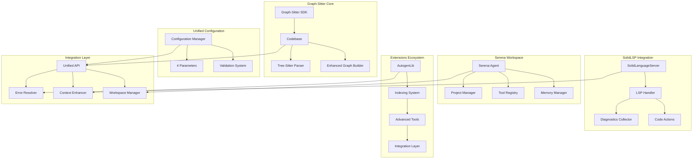

# Comprehensive Interface Connectivity Map

## Overview
This document provides a complete interface connectivity map showing how SolidLSP, Serena tools, Graph-Sitter, and Extensions interact to create a unified system with automatic error resolution and enhanced context capabilities.

## System Architecture Overview



## Component Interface Definitions

### 1. Graph-Sitter Core Interfaces

#### ICodebase
```python
from abc import ABC, abstractmethod
from typing import List, Dict, Any, Optional
from pathlib import Path

class ICodebase(ABC):
    """Core codebase interface for graph-sitter integration"""
    
    @abstractmethod
    def get_files(self) -> List[Path]:
        """Get all files in the codebase"""
        pass
    
    @abstractmethod
    def get_classes(self) -> List['Class']:
        """Get all classes in the codebase"""
        pass
    
    @abstractmethod
    def get_functions(self) -> List['Function']:
        """Get all functions in the codebase"""
        pass
    
    @abstractmethod
    def get_symbols(self) -> List['Symbol']:
        """Get all symbols in the codebase"""
        pass
    
    @abstractmethod
    def parse_file(self, file_path: Path) -> 'TSNode':
        """Parse a file using tree-sitter"""
        pass
    
    @abstractmethod
    def build_graph(self) -> 'SimpleGraph':
        """Build codebase graph"""
        pass
```

#### ITreeSitterParser
```python
class ITreeSitterParser(ABC):
    """Tree-sitter parser interface"""
    
    @abstractmethod
    def parse_file(self, filepath: Path, content: str) -> 'TSNode':
        """Parse file content into AST"""
        pass
    
    @abstractmethod
    def get_parser_for_language(self, language: str) -> 'Parser':
        """Get parser for specific language"""
        pass
    
    @abstractmethod
    def extract_symbols(self, ast_node: 'TSNode') -> List['Symbol']:
        """Extract symbols from AST"""
        pass
    
    @abstractmethod
    def find_syntax_errors(self, ast_node: 'TSNode') -> List['SyntaxError']:
        """Find syntax errors in AST"""
        pass
```

### 2. SolidLSP Integration Interfaces

#### ILanguageServer
```python
class ILanguageServer(ABC):
    """Language server interface for LSP integration"""
    
    @abstractmethod
    def start_server(self) -> bool:
        """Start the language server"""
        pass
    
    @abstractmethod
    def stop_server(self) -> bool:
        """Stop the language server"""
        pass
    
    @abstractmethod
    def get_diagnostics(self, file_path: str) -> List['Diagnostic']:
        """Get diagnostics for a file"""
        pass
    
    @abstractmethod
    def get_code_actions(self, file_path: str, line: int, character: int, 
                        diagnostics: List['Diagnostic']) -> List['CodeAction']:
        """Get available code actions for diagnostics"""
        pass
    
    @abstractmethod
    def apply_workspace_edit(self, edit: 'WorkspaceEdit') -> bool:
        """Apply workspace edit"""
        pass
    
    @abstractmethod
    def get_symbols(self, file_path: str) -> List['UnifiedSymbolInformation']:
        """Get symbols in a file"""
        pass
    
    @abstractmethod
    def find_references(self, file_path: str, line: int, character: int) -> List['Location']:
        """Find references to symbol at position"""
        pass
```

#### IDiagnosticCollector
```python
class IDiagnosticCollector(ABC):
    """Diagnostic collection interface"""
    
    @abstractmethod
    def collect_diagnostics(self, file_paths: List[str]) -> Dict[str, List['Diagnostic']]:
        """Collect diagnostics for multiple files"""
        pass
    
    @abstractmethod
    def get_workspace_diagnostics(self) -> Dict[str, List['Diagnostic']]:
        """Get all workspace diagnostics"""
        pass
    
    @abstractmethod
    def subscribe_to_diagnostic_changes(self, callback: callable) -> None:
        """Subscribe to diagnostic change events"""
        pass
    
    @abstractmethod
    def filter_diagnostics(self, diagnostics: List['Diagnostic'], 
                          severity: 'DiagnosticSeverity') -> List['Diagnostic']:
        """Filter diagnostics by severity"""
        pass
```

### 3. Serena Workspace Interfaces

#### IProjectManager
```python
class IProjectManager(ABC):
    """Project management interface"""
    
    @abstractmethod
    def load_project(self, project_root: Path) -> 'Project':
        """Load project from directory"""
        pass
    
    @abstractmethod
    def get_project_config(self) -> 'ProjectConfig':
        """Get project configuration"""
        pass
    
    @abstractmethod
    def get_ignored_patterns(self) -> List[str]:
        """Get ignored file patterns"""
        pass
    
    @abstractmethod
    def is_file_ignored(self, file_path: str) -> bool:
        """Check if file should be ignored"""
        pass
    
    @abstractmethod
    def read_file(self, relative_path: str) -> str:
        """Read file content"""
        pass
    
    @abstractmethod
    def write_file(self, relative_path: str, content: str) -> None:
        """Write file content"""
        pass
```

#### ISerenaAgent
```python
class ISerenaAgent(ABC):
    """Serena agent interface"""
    
    @abstractmethod
    def activate_project(self, project_root: str) -> None:
        """Activate project in agent"""
        pass
    
    @abstractmethod
    def execute_tool(self, tool_name: str, **kwargs) -> str:
        """Execute a tool with parameters"""
        pass
    
    @abstractmethod
    def get_available_tools(self) -> List[str]:
        """Get list of available tools"""
        pass
    
    @abstractmethod
    def create_language_server_symbol_retriever(self) -> 'SymbolRetriever':
        """Create symbol retriever"""
        pass
    
    @abstractmethod
    def reset_language_server(self) -> None:
        """Reset language server"""
        pass
    
    @abstractmethod
    def load_memory(self, name: str) -> str:
        """Load memory by name"""
        pass
    
    @abstractmethod
    def save_memory(self, name: str, content: str) -> str:
        """Save memory with name"""
        pass
```

### 4. Extensions Ecosystem Interfaces

#### IEnhancedContextProvider
```python
class IEnhancedContextProvider(ABC):
    """Enhanced context provider interface"""
    
    @abstractmethod
    def get_comprehensive_context(self, location: 'Location') -> 'EnhancedContext':
        """Get comprehensive context for a location"""
        pass
    
    @abstractmethod
    def get_symbol_context(self, symbol: 'Symbol') -> 'SymbolContext':
        """Get context for a specific symbol"""
        pass
    
    @abstractmethod
    def get_error_context(self, diagnostic: 'Diagnostic') -> 'ErrorContext':
        """Get context for an error/diagnostic"""
        pass
    
    @abstractmethod
    def analyze_impact_radius(self, location: 'Location') -> 'ImpactAnalysis':
        """Analyze impact radius of changes at location"""
        pass
    
    @abstractmethod
    def get_type_information(self, location: 'Location') -> 'TypeInfo':
        """Get type information at location"""
        pass
    
    @abstractmethod
    def get_parameter_information(self, location: 'Location') -> List['ParameterInfo']:
        """Get parameter information at location"""
        pass
```

#### IIndexingSystem
```python
class IIndexingSystem(ABC):
    """Indexing system interface"""
    
    @abstractmethod
    def build_code_index(self, codebase: ICodebase) -> None:
        """Build code index for codebase"""
        pass
    
    @abstractmethod
    def build_symbol_index(self, codebase: ICodebase) -> None:
        """Build symbol index for codebase"""
        pass
    
    @abstractmethod
    def build_file_index(self, root_path: Path) -> None:
        """Build file index for directory"""
        pass
    
    @abstractmethod
    def search_code(self, query: str) -> List['CodeMatch']:
        """Search code by query"""
        pass
    
    @abstractmethod
    def find_symbol(self, name: str) -> List['SymbolInfo']:
        """Find symbol by name"""
        pass
    
    @abstractmethod
    def get_symbol_relationships(self, symbol: str) -> 'SymbolGraph':
        """Get symbol relationships"""
        pass
```

### 5. Configuration Management Interfaces

#### IConfigurationManager
```python
class IConfigurationManager(ABC):
    """Configuration management interface"""
    
    @abstractmethod
    def load_config(self, config_path: Path) -> 'IntegrationConfig':
        """Load configuration from file"""
        pass
    
    @abstractmethod
    def validate_config(self, config: 'IntegrationConfig') -> 'ValidationResult':
        """Validate configuration"""
        pass
    
    @abstractmethod
    def get_parameter_value(self, parameter: str) -> Any:
        """Get configuration parameter value"""
        pass
    
    @abstractmethod
    def set_parameter_value(self, parameter: str, value: Any) -> None:
        """Set configuration parameter value"""
        pass
    
    @abstractmethod
    def is_feature_enabled(self, feature: str) -> bool:
        """Check if feature is enabled"""
        pass
```

## Data Flow Architecture

### 1. Initialization Flow
```python
# Unified initialization sequence
def initialize_integrated_system(repo_path: str, config: dict) -> 'IntegratedCodebase':
    """
    1. Configuration Loading and Validation
    2. Graph-Sitter Codebase Initialization
    3. SolidLSP Server Startup (if lspserver=true)
    4. Serena Workspace Activation (if workspace integration enabled)
    5. Extensions System Initialization (if enhancedcontext=true)
    6. Error Resolution System Setup (if errorautoresolve=true)
    7. Diagnostic Collection Startup (if diagnostics=true)
    """
    
    # Step 1: Configuration
    config_manager = ConfigurationManager()
    unified_config = config_manager.load_and_validate_config(config)
    
    # Step 2: Graph-Sitter Core
    codebase = Codebase(repo_path)
    tree_sitter_parser = TreeSitterParser()
    graph_builder = EnhancedGraphBuilder()
    
    # Step 3: SolidLSP Integration (conditional)
    lsp_manager = None
    if unified_config.lspserver:
        lsp_manager = LSPManager(unified_config.lsp_config)
        lsp_manager.start_servers_for_languages(codebase.detected_languages)
    
    # Step 4: Serena Workspace (conditional)
    serena_agent = None
    if unified_config.enable_serena_workspace:
        serena_agent = SerenaAgent.create_for_project(repo_path)
        serena_agent.activate_project(repo_path)
    
    # Step 5: Extensions System (conditional)
    context_provider = None
    if unified_config.enhancedcontext:
        context_provider = EnhancedContextProvider(unified_config.context_config)
        context_provider.initialize_autogenlib()
        context_provider.build_indexes(codebase)
    
    # Step 6: Error Resolution (conditional)
    error_resolver = None
    if unified_config.errorautoresolve:
        error_resolver = AutomaticErrorResolver(lsp_manager, serena_agent, context_provider)
    
    # Step 7: Diagnostic Collection (conditional)
    diagnostic_collector = None
    if unified_config.diagnostics:
        diagnostic_collector = DiagnosticCollector(lsp_manager)
        diagnostic_collector.start_collection()
    
    # Create integrated system
    return IntegratedCodebase(
        codebase=codebase,
        lsp_manager=lsp_manager,
        serena_agent=serena_agent,
        context_provider=context_provider,
        error_resolver=error_resolver,
        diagnostic_collector=diagnostic_collector,
        config=unified_config
    )
```

### 2. Error Resolution Flow
```python
# Comprehensive error resolution pipeline
def resolve_errors_with_full_context(integrated_codebase: 'IntegratedCodebase') -> 'ResolutionResult':
    """
    1. Diagnostic Collection from LSP servers
    2. Context Enhancement using Extensions
    3. Error Analysis using Serena tools
    4. Resolution Strategy Determination
    5. Automatic Fix Application
    6. Validation and Reporting
    """
    
    results = []
    
    # Step 1: Collect all diagnostics
    all_diagnostics = integrated_codebase.diagnostic_collector.get_workspace_diagnostics()
    
    for file_path, diagnostics in all_diagnostics.items():
        for diagnostic in diagnostics:
            
            # Step 2: Get enhanced context
            enhanced_context = integrated_codebase.context_provider.get_error_context(diagnostic)
            
            # Step 3: Analyze with Serena tools
            serena_analysis = integrated_codebase.serena_agent.analyze_error(
                diagnostic, enhanced_context
            )
            
            # Step 4: Determine resolution strategy
            strategy = integrated_codebase.error_resolver.determine_strategy(
                diagnostic, enhanced_context, serena_analysis
            )
            
            # Step 5: Apply fix if strategy found
            if strategy and strategy.is_safe_to_apply():
                fix_result = integrated_codebase.error_resolver.apply_fix(strategy)
                results.append(fix_result)
    
    # Step 6: Validate and report
    return ResolutionResult(
        total_errors=sum(len(diags) for diags in all_diagnostics.values()),
        resolved_errors=len([r for r in results if r.success]),
        resolution_details=results
    )
```

### 3. Enhanced Context Flow
```python
# Enhanced context retrieval pipeline
def get_enhanced_context_for_location(location: 'Location', 
                                    integrated_codebase: 'IntegratedCodebase') -> 'EnhancedContext':
    """
    1. Tree-Sitter AST Analysis
    2. LSP Symbol Information
    3. Serena Symbol Analysis
    4. AutogenLib Context Enhancement
    5. Indexing System Queries
    6. Impact Radius Analysis
    """
    
    # Step 1: AST Analysis
    file_content = integrated_codebase.codebase.read_file(location.file_path)
    ast_node = integrated_codebase.codebase.parse_file(location.file_path, file_content)
    ast_context = extract_ast_context(ast_node, location)
    
    # Step 2: LSP Symbol Information
    lsp_symbols = integrated_codebase.lsp_manager.get_symbols(location.file_path)
    lsp_context = find_symbols_at_location(lsp_symbols, location)
    
    # Step 3: Serena Symbol Analysis
    serena_symbols = integrated_codebase.serena_agent.execute_tool(
        "FindSymbolTool", 
        name_path=location.symbol_name,
        include_body=True
    )
    
    # Step 4: AutogenLib Enhancement
    autogenlib_context = integrated_codebase.context_provider.get_autogenlib_context(location)
    
    # Step 5: Indexing System Queries
    related_symbols = integrated_codebase.context_provider.indexing_system.find_related_symbols(location)
    similar_patterns = integrated_codebase.context_provider.indexing_system.find_similar_patterns(location)
    
    # Step 6: Impact Analysis
    impact_analysis = integrated_codebase.context_provider.analyze_impact_radius(location)
    
    return EnhancedContext(
        location=location,
        ast_context=ast_context,
        lsp_context=lsp_context,
        serena_symbols=serena_symbols,
        autogenlib_context=autogenlib_context,
        related_symbols=related_symbols,
        similar_patterns=similar_patterns,
        impact_analysis=impact_analysis,
        type_information=get_type_info(location),
        parameter_information=get_parameter_info(location),
        variable_context=get_variable_context(location)
    )
```

## Integration Patterns

### 1. Observer Pattern for Diagnostic Updates
```python
class DiagnosticObserver:
    """Observer pattern for diagnostic change notifications"""
    
    def __init__(self, integrated_codebase: 'IntegratedCodebase'):
        self.integrated_codebase = integrated_codebase
        
        # Subscribe to LSP diagnostic changes
        if integrated_codebase.lsp_manager:
            integrated_codebase.lsp_manager.subscribe_to_diagnostics(
                self.on_diagnostics_changed
            )
    
    def on_diagnostics_changed(self, file_path: str, diagnostics: List['Diagnostic']):
        """Handle diagnostic changes"""
        
        # Trigger automatic error resolution if enabled
        if self.integrated_codebase.config.errorautoresolve:
            self.integrated_codebase.error_resolver.resolve_file_errors(file_path)
        
        # Update enhanced context cache
        if self.integrated_codebase.config.enhancedcontext:
            self.integrated_codebase.context_provider.invalidate_cache(file_path)
        
        # Notify Serena agent
        if self.integrated_codebase.serena_agent:
            self.integrated_codebase.serena_agent.on_diagnostics_updated(file_path, diagnostics)
```

### 2. Strategy Pattern for Error Resolution
```python
class ErrorResolutionStrategy(ABC):
    """Base class for error resolution strategies"""
    
    @abstractmethod
    def can_resolve(self, diagnostic: 'Diagnostic', context: 'EnhancedContext') -> bool:
        """Check if this strategy can resolve the error"""
        pass
    
    @abstractmethod
    def resolve(self, diagnostic: 'Diagnostic', context: 'EnhancedContext') -> 'ResolutionResult':
        """Resolve the error"""
        pass

class ImportErrorStrategy(ErrorResolutionStrategy):
    """Strategy for resolving import errors"""
    
    def can_resolve(self, diagnostic: 'Diagnostic', context: 'EnhancedContext') -> bool:
        return "import" in diagnostic.message.lower()
    
    def resolve(self, diagnostic: 'Diagnostic', context: 'EnhancedContext') -> 'ResolutionResult':
        # Use Serena tools to find and add missing imports
        # Use LSP code actions for import fixes
        # Use enhanced context to determine correct import paths
        pass

class TypeErrorStrategy(ErrorResolutionStrategy):
    """Strategy for resolving type errors"""
    
    def can_resolve(self, diagnostic: 'Diagnostic', context: 'EnhancedContext') -> bool:
        return "type" in diagnostic.message.lower()
    
    def resolve(self, diagnostic: 'Diagnostic', context: 'EnhancedContext') -> 'ResolutionResult':
        # Use enhanced context type information
        # Apply LSP code actions for type fixes
        # Use Serena symbol tools for type corrections
        pass
```

### 3. Factory Pattern for Component Creation
```python
class IntegrationComponentFactory:
    """Factory for creating integration components"""
    
    @staticmethod
    def create_lsp_manager(config: 'IntegrationConfig') -> 'LSPManager':
        """Create LSP manager based on configuration"""
        if not config.lspserver:
            return None
        
        return LSPManager(
            languages=config.detected_languages,
            settings=config.lsp_settings
        )
    
    @staticmethod
    def create_serena_agent(project_root: str, config: 'IntegrationConfig') -> 'SerenaAgent':
        """Create Serena agent based on configuration"""
        if not config.enable_serena_workspace:
            return None
        
        return SerenaAgent.create_for_project(
            project_root=project_root,
            config=config.serena_config
        )
    
    @staticmethod
    def create_context_provider(config: 'IntegrationConfig') -> 'EnhancedContextProvider':
        """Create enhanced context provider based on configuration"""
        if not config.enhancedcontext:
            return None
        
        return EnhancedContextProvider(
            enable_autogenlib=True,
            enable_indexing=True,
            config=config.context_config
        )
```

## API Surface

### 1. Unified Top-Level API
```python
class IntegratedCodebase:
    """Main API for integrated codebase functionality"""
    
    def __init__(self, codebase: ICodebase, lsp_manager: ILanguageServer = None,
                 serena_agent: ISerenaAgent = None, context_provider: IEnhancedContextProvider = None,
                 error_resolver: 'IErrorResolver' = None, diagnostic_collector: IDiagnosticCollector = None,
                 config: 'IntegrationConfig' = None):
        self.codebase = codebase
        self.lsp_manager = lsp_manager
        self.serena_agent = serena_agent
        self.context_provider = context_provider
        self.error_resolver = error_resolver
        self.diagnostic_collector = diagnostic_collector
        self.config = config
    
    # Core functionality
    def get_diagnostics(self) -> Dict[str, List['Diagnostic']]:
        """Get all diagnostics in the codebase"""
        if self.diagnostic_collector:
            return self.diagnostic_collector.get_workspace_diagnostics()
        return {}
    
    def resolve_errors_automatically(self) -> 'ResolutionResult':
        """Automatically resolve errors in the codebase"""
        if self.error_resolver:
            return self.error_resolver.resolve_all_errors()
        return ResolutionResult(success=False, message="Error resolution not enabled")
    
    def get_enhanced_context(self, location: 'Location') -> 'EnhancedContext':
        """Get enhanced context for a location"""
        if self.context_provider:
            return self.context_provider.get_comprehensive_context(location)
        return EnhancedContext(location=location)
    
    def list_errors_with_context(self) -> List['ErrorWithContext']:
        """List all errors with their enhanced context"""
        errors_with_context = []
        diagnostics = self.get_diagnostics()
        
        for file_path, file_diagnostics in diagnostics.items():
            for diagnostic in file_diagnostics:
                location = Location(file_path=file_path, line=diagnostic.range.start.line,
                                  character=diagnostic.range.start.character)
                context = self.get_enhanced_context(location)
                errors_with_context.append(ErrorWithContext(diagnostic=diagnostic, context=context))
        
        return errors_with_context
    
    def get_resolution_suggestions(self, diagnostic: 'Diagnostic') -> List['ResolutionSuggestion']:
        """Get resolution suggestions for a diagnostic"""
        if self.error_resolver:
            return self.error_resolver.get_resolution_suggestions(diagnostic)
        return []

# Factory function for easy creation
def from_repo(repo_path: str, **config_params) -> IntegratedCodebase:
    """Create integrated codebase from repository path"""
    config = {
        'lspserver': config_params.get('lspserver', True),
        'diagnostics': config_params.get('diagnostics', True),
        'errorautoresolve': config_params.get('errorautoresolve', True),
        'enhancedcontext': config_params.get('enhancedcontext', True),
        **config_params
    }
    
    return initialize_integrated_system(repo_path, config)
```

### 2. Configuration API
```python
# Simple configuration interface
class GraphSitterConfig:
    """Graph-sitter configuration with integration parameters"""
    
    def __init__(self):
        self.lspserver: bool = True
        self.diagnostics: bool = True
        self.errorautoresolve: bool = True
        self.enhancedcontext: bool = True
        
        # Advanced configuration
        self.lsp_languages: List[str] = []  # Auto-detect if empty
        self.error_resolution_strategies: List[str] = ["import", "type", "syntax"]
        self.context_depth: int = 3
        self.max_context_size: int = 10000
        
        # Performance settings
        self.enable_caching: bool = True
        self.parallel_processing: bool = True
        self.lazy_initialization: bool = True
    
    @classmethod
    def from_dict(cls, config_dict: dict) -> 'GraphSitterConfig':
        """Create configuration from dictionary"""
        config = cls()
        for key, value in config_dict.items():
            if hasattr(config, key):
                setattr(config, key, value)
        return config
    
    def to_dict(self) -> dict:
        """Convert configuration to dictionary"""
        return {
            attr: getattr(self, attr)
            for attr in dir(self)
            if not attr.startswith('_') and not callable(getattr(self, attr))
        }
```

This comprehensive interface connectivity map provides the foundation for implementing the unified integration system with all four configuration parameters working together seamlessly.
