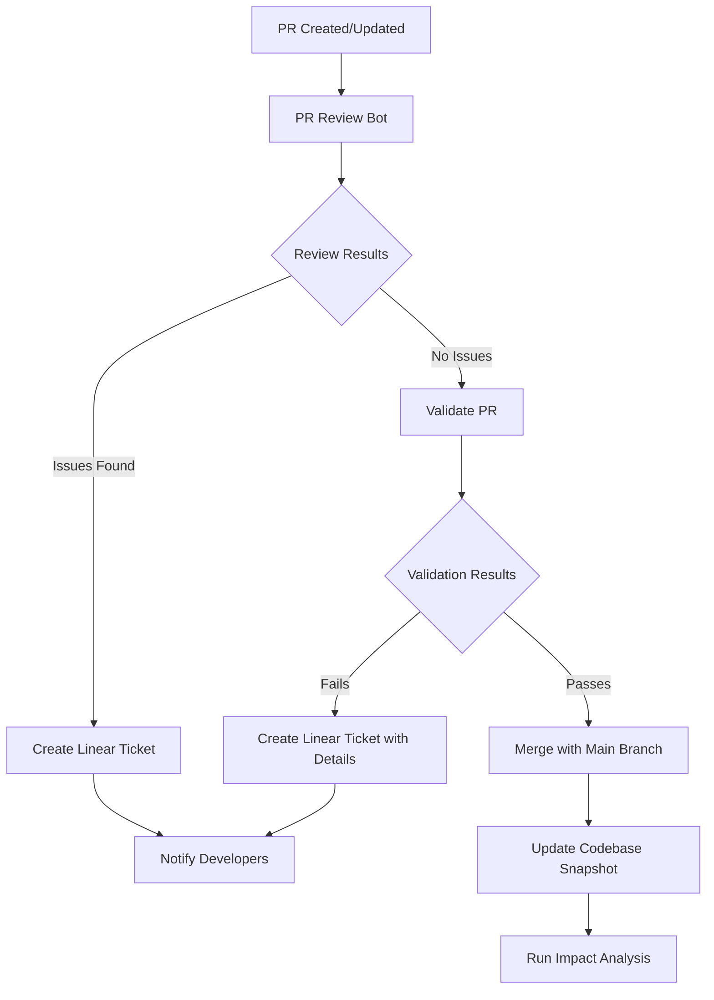

# PR Review and Management Workflow
This document outlines a comprehensive workflow for reviewing, validating, and managing Pull Requests (PRs) using Codegen components. The workflow integrates multiple components to create an end-to-end solution for PR management, from initial review to merging with the main branch or creating tickets for issues.
## Workflow Overview

## Key Components
The workflow integrates several Codegen components:
1. **PR Review Bot**: Automatically reviews PRs and provides detailed feedback
2. **Snapshot Event Handler**: Maintains codebase snapshots for fast analysis
3. **AI Impact Analysis**: Tracks the impact of AI-generated code on the codebase
4. **Linear Integration**: Creates and manages tickets for issues found
5. **Slack Integration**: Provides notifications and interaction capabilities
6. **Automated Validation**: Validates PRs against the codebase
## Component Interactions
### 1. PR Review Process
When a PR is created or updated:
1. The **PR Review Bot** is triggered to analyze the changes
2. The bot examines:
   - Code quality and style
   - Potential bugs or issues
   - Test coverage
   - Documentation
   - Compatibility with existing codebase
3. The bot provides detailed feedback as comments on the PR
4. If significant issues are found, a Linear ticket is created automatically
### 2. PR Validation Process
After the review process:
1. The **Automated Validation** component checks:
   - Compatibility with the main branch
   - Integration tests
   - Build success
   - Performance impacts
2. If validation passes, the PR can be automatically or manually merged
3. If validation fails, a Linear ticket is created with detailed information
### 3. Post-Merge Process
After a PR is merged:
1. The **Snapshot Event Handler** updates the codebase snapshot
2. The **AI Impact Analysis** component evaluates the impact of the changes
3. Metrics and insights are stored for future reference
4. Notifications are sent to relevant stakeholders via Slack
## Implementation Details
### PR Review Bot Configuration
The PR Review Bot can be configured to:
- Automatically review PRs with specific labels
- Focus on specific aspects of the code
- Provide different levels of feedback based on PR size or importance
- Integrate with CI/CD pipelines
```python
# Example PR Review Bot configuration
pr_review_config = {
    "auto_review_labels": ["needs-review", "Codegen"],
    "review_depth": "detailed",  # Options: "basic", "detailed", "comprehensive"
    "focus_areas": ["code_quality", "security", "performance"],
    "notification_channel": "dev-notifications"
}
```
### Validation Component Configuration
The Validation component can be configured to:
- Run specific tests or checks
- Set thresholds for acceptance
- Define merge criteria
- Specify notification preferences
```python
# Example Validation configuration
validation_config = {
    "required_checks": ["unit_tests", "integration_tests", "build"],
    "performance_threshold": 0.95,  # 95% of baseline performance
    "auto_merge": False,  # Require manual approval
    "notification_preferences": {
        "slack": True,
        "email": False,
        "linear": True
    }
}
```
### Linear Integration Configuration
The Linear integration can be configured to:
- Create tickets with specific templates
- Assign tickets to specific teams or individuals
- Set priorities based on issue severity
- Link tickets to PRs and commits
```python
# Example Linear integration configuration
linear_config = {
    "team_id": "TEAM_123",
    "issue_template": "PR Review Feedback",
    "auto_assign": True,
    "priority_mapping": {
        "critical": 1,
        "high": 2,
        "medium": 3,
        "low": 4
    }
}
```
## Integrated Workflow Implementation
The following components from the Codegen examples directory are used to implement this workflow:
1. **PR Review Bot** (`codegen-examples/examples/pr_review_bot`)
2. **Snapshot Event Handler** (`codegen-examples/examples/snapshot_event_handler`)
3. **AI Impact Analysis** (`codegen-examples/examples/ai_impact_analysis`)
4. **Ticket-to-PR** (`codegen-examples/examples/ticket-to-pr`) - used in reverse for PR-to-Ticket
5. **Integrated Workflow** (`codegen-examples/examples/integrated_workflow`)
### Example Implementation
Below is a simplified implementation of the integrated workflow:
```python
from codegen.extensions.events.codegen_app import CodegenApp
from codegen.extensions.github.types.pull_request import PullRequestOpenedEvent, PullRequestClosedEvent
from codegen.extensions.github.types.issues import IssueOpenedEvent
from codegen.agents.issue_solver import IssueSolverAgent
from codegen.extensions.attribution.cli import analyze_ai_impact
class PRReviewAndManagementWorkflow:
    def __init__(self, repo, base_branch="main", config=None):
        self.repo = repo
        self.base_branch = base_branch
        self.config = config or {}
        
        # Initialize components
        self.cg = CodegenApp(name="pr-review-workflow")
        
        # Set up codebase snapshots
        self.setup_snapshots()
        
        # Register event handlers
        self.setup_handlers()
    
    def setup_snapshots(self):
        """Set up codebase snapshots for fast analysis."""
        self.cg.create_snapshot(
            repo=self.repo,
            branch=self.base_branch,
            snapshot_id=f"{self.repo.replace('/', '-')}-{self.base_branch}"
        )
    
    def setup_handlers(self):
        """Register event handlers for GitHub events."""
        
        @self.cg.github.event("pull_request:opened")
        def handle_pr_opened(event: PullRequestOpenedEvent):
            """Handle new pull requests."""
            self.review_pr(event.pull_request.number)
        
        @self.cg.github.event("pull_request:closed")
        def handle_pr_merged(event: PullRequestClosedEvent):
            """Handle merged pull requests."""
            if event.pull_request.merged:
                self.update_snapshot()
                self.analyze_impact()
    
    def review_pr(self, pr_number):
        """Review a pull request and provide feedback."""
        # Get the PR details
        pr = self.cg.github.client.get_pull_request(self.repo, pr_number)
        
        # Get the diff
        diff = self.cg.github.client.get_pull_request_diff(self.repo, pr_number)
        
        # Load the codebase snapshot
        snapshot_id = f"{self.repo.replace('/', '-')}-{self.base_branch}"
        codebase = self.cg.get_snapshot(snapshot_id)
        
        # Generate review feedback
        feedback = self._generate_review_feedback(pr, diff, codebase)
        
        # Add the review comment
        self.cg.github.client.create_pull_request_review(
            repo=self.repo,
            pr_number=pr_number,
            body=feedback,
            event="COMMENT"
        )
        
        # Validate the PR
        validation_result = self.validate_pr(pr_number)
        
        # Handle validation result
        if validation_result["success"]:
            # Optionally auto-merge
            if self.config.get("auto_merge", False):
                self.merge_pr(pr_number)
        else:
            # Create a Linear ticket for failed validation
            self.create_linear_ticket(
                title=f"PR #{pr_number} Validation Failed",
                description=validation_result["details"],
                pr_url=pr["html_url"]
            )
    
    def validate_pr(self, pr_number):
        """Validate a PR against the codebase."""
        # This is a simplified implementation
        # In a real-world scenario, you would run tests, checks, etc.
        
        return {
            "success": True,
            "details": "All validation checks passed."
        }
    
    def merge_pr(self, pr_number):
        """Merge a PR into the main branch."""
        self.cg.github.client.merge_pull_request(
            repo=self.repo,
            pr_number=pr_number,
            commit_title=f"Merge PR #{pr_number}",
            commit_message="Automatically merged by PR Review Workflow"
        )
    
    def create_linear_ticket(self, title, description, pr_url):
        """Create a Linear ticket for issues found."""
        # Get the Linear team ID
        team_id = self.config.get("linear_team_id")
        
        # Create the ticket
        ticket = self.cg.linear.client.create_issue(
            team_id=team_id,
            title=title,
            description=f"{description}\n\nPR: {pr_url}"
        )
        
        return ticket
    
    def update_snapshot(self):
        """Update the codebase snapshot after a merge."""
        self.cg.update_snapshot(
            repo=self.repo,
            branch=self.base_branch,
            snapshot_id=f"{self.repo.replace('/', '-')}-{self.base_branch}"
        )
    
    def analyze_impact(self):
        """Analyze the impact of changes on the codebase."""
        # Get the codebase
        codebase = self.cg.get_codebase(self.repo, self.base_branch)
        
        # Define AI authors
        ai_authors = ["github-actions[bot]", "dependabot[bot]", "codegen-bot"]
        
        # Run the analysis
        results = analyze_ai_impact(codebase, ai_authors)
        
        # Generate a summary
        ai_lines = results.get("ai_lines", 0)
        total_lines = results.get("total_lines", 1)
        ai_percentage = (ai_lines / total_lines) * 100
        
        summary = f"AI-generated code: {ai_percentage:.1f}% ({ai_lines} out of {total_lines} lines)"
        
        return summary
```
## Deployment
The workflow can be deployed as a Modal application:
```python
import modal
app = modal.App("pr-review-workflow")
@app.function(
    image=modal.Image.debian_slim().pip_install(
        "codegen",
        "python-dotenv",
        "slack-sdk",
        "pydantic",
    ),
    secrets=[
        modal.Secret.from_name("github-secret"),
        modal.Secret.from_name("slack-secret"),
        modal.Secret.from_name("linear-secret"),
    ],
)
def run_workflow(repo, base_branch="main", config=None):
    """Run the PR Review and Management Workflow."""
    from workflow import PRReviewAndManagementWorkflow
    
    workflow = PRReviewAndManagementWorkflow(repo, base_branch, config)
    
    # Keep the function running to handle events
    while True:
        time.sleep(60)
```
## Conclusion
This PR Review and Management Workflow provides a comprehensive solution for managing PRs from initial review to merging with the main branch. By integrating multiple Codegen components, it offers:
1. Automated PR reviews with detailed feedback
2. Validation against the codebase
3. Automatic ticket creation for issues
4. Impact analysis after merges
5. Notifications and interaction via Slack
The workflow can be customized to fit specific project needs and integrated with existing CI/CD pipelines.